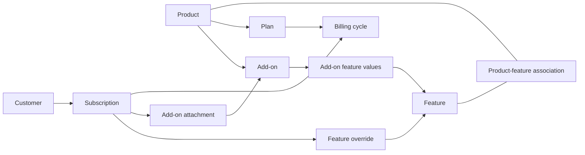

# Relationships

The database separates reusable definitions, customer agreements, and accounting history. Public methods take stable string keys; internal numeric IDs join the tables.

## Catalog and subscriptions

| Relationship | Meaning |
| --- | --- |
| Feature ↔ product | Many-to-many. The association stores feature-resolution rules. |
| Product → plan | A plan belongs to one product. |
| Plan ↔ feature value | One configured value per plan and associated feature. |
| Plan → billing cycle | A billing cycle belongs to one plan and defines cadence. |
| Customer → subscription | A customer can have several subscriptions, including several to the same product. |
| Subscription → billing cycle and plan | Selecting a cycle determines the plan and product. The database also retains the plan reference. |
| Subscription → feature override | At most one override per feature; another write replaces it. |
| Product → add-on | A package belongs to one product and supplies values for its associated features. |
| Subscription ↔ add-on | An attachment stores quantity and active/cancelled state, unique per subscription and add-on. |

Plan and add-on values are strings validated according to the feature type. A feature can be reused across products, but an add-on belongs to a specific product. Plans and packages use features already associated with that product.

The diagram shows ownership and references, not a sequence of API calls. See [How Feature Values Are Calculated](feature-resolution.md) for how these values combine.

## Keys and ownership

Use your application's stable account identifier as the customer key. A customer can represent an organization or an individual; Subscrio does not decide which users may act for it. Enforce that mapping in your application.

Catalog keys are globally unique within their object type. A plan key is not scoped to its product, and a billing-cycle key is not scoped to its plan. Keys on existing records are immutable through ordinary update methods. Hooks can adjust supported fields during creation, so inspect the returned record if you install custom handlers.

## Metered usage

`metered_feature_config` stores a feature's scope, aggregation, enforcement, and reset period. A usage balance identifies the customer, product, feature, period start, and optional subscription. Customer-scoped counters omit that subscription reference.

`usage_events` records accepted reports, request fingerprints, and saved responses. A key is unique per customer across usage reports. It is not the same namespace as credit-operation keys. History remains when the current period changes.

## Credits

| Tables | Role |
| --- | --- |
| `credit_currencies` | Global wallet currencies. |
| `plan_credit_grants`, `credit_consumption_rules` | Recurring plan allowances and per-feature costs. |
| `credit_wallets` | Customer/currency ownership and accounting coordination. |
| `credit_grants` | Original and remaining amounts, expiry, priority, and optional subscription attribution. |
| `credit_operations` | Idempotency keys, request fingerprints, and result snapshots, including spending allocations. |
| `credit_ledger_entries` | Recorded movements against individual grants. |
| `subscription_credit_grant_states` | Scheduling anchors and the next due grant boundary. |

Wallets are shared across a customer's products. Subscription attribution explains where a grant came from and allows subscription-specific expiration; it does not make a separate wallet.

## History and deletion

Accounting and attachment references can block deletion of customers, subscriptions, features, products, or currencies. Detaching an add-on preserves a cancelled attachment rather than removing its row. Service-level checks also require certain catalog records to be archived before deletion.

Some original catalog relationships use database cascades. Do not infer that every delete is blocked or that a cascade makes deleting history safe. Use the owning library method, inspect its documented conditions, and archive records that should remain available for historical explanation.

Core tables live in the `subscrio` schema. The PostgreSQL audit-log and payments extensions add their own tables there and manage their schemas separately. See [Schema Upgrade](upgrading-entitlements.md) before changing an existing installation.
