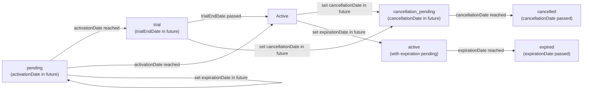

# Subscription Lifecycle Reference

This guide explains every subscription status exposed by `SubscriptionDto.status`, the exact calculation rules, and how statuses can flow over time. Status is computed on read. TypeScript uses the `subscrio.subscription_status_view` SQL view. .NET uses the same CASE order in `SubscriptionMapper.ComputeStatus`. There is no `suspended` subscription status. `Suspended` exists only on `CustomerStatus`.

## Calculation Order

Statuses are evaluated in this order. The first matching rule wins:

1. `cancellation_pending` — `cancellationDate` is set and is in the future
2. `cancelled` — `cancellationDate` is set and is now or in the past
3. `expired` — `expirationDate` is set and is now or in the past
4. `pending` — `activationDate` is set and is in the future
5. `trial` — `trialEndDate` is set and is in the future
6. `active` — default when none of the rules above match

A missing `activationDate` does not produce `pending`. Create defaults `activationDate` to now unless you pass one. If you later clear it, the remaining rules decide the status (`trial` or `active`).

Any set `cancellationDate` wins before expiration, trial, or activation.

## Status Definitions

| Status | How it is calculated | Typical usage |
| --- | --- | --- |
| `cancellation_pending` | `cancellationDate` is set and is in the future. | Grace period after a cancel request. |
| `cancelled` | `cancellationDate` is set and is now or in the past. | Final state after the cancellation date. |
| `expired` | No cancellation, and `expirationDate` is now or in the past. | Fixed-term or trial-to-expire subscriptions. |
| `pending` | No cancellation or expiration, and `activationDate` is in the future. | Pre-dated activation. |
| `trial` | None of the above, and `trialEndDate` is in the future. | Limited-time access before paid billing. |
| `active` | None of the above. | Normal paid access. |

> Cancellation always wins over trial, active, pending, and expired. A future `cancellationDate` is `cancellation_pending` even if the trial is still running.

## Status Flow Diagram



The diagram illustrates common flows but does not represent every edge case (e.g., reactivation or plan transitions). Any state may move directly to `cancelled` or `expired` when the relevant date is set retroactively.

## Subscription Transitions

When a subscription expires and its plan has an `onExpireTransitionToBillingCycleKey` configured, the subscription can be automatically transitioned to a new plan. This is handled by `transitionExpiredSubscriptions()` / `TransitionExpiredSubscriptionsAsync()`.

### Transition Process

1. **Expired subscriptions** with transition-enabled plans are identified
2. **Old subscription** is marked as transitioned (archived with `transitioned_at` timestamp)
3. **New subscription** is created to the transition billing cycle
4. **Subscription key** is versioned: `original-key` → `original-key-v1` → `original-key-v2`, etc.

### Transition Tracking

- **`transitioned_at`**: UTC timestamp set when a subscription is transitioned
- **Archived status**: Transitioned subscriptions are archived (`isArchived = true`)
- **Stripe IDs**: Original Stripe subscription ID remains on the archived subscription for historical reference
- **Feature overrides**: Do not carry over to the new subscription
- **Metadata**: Carries over to the new subscription

### Querying Transitioned Subscriptions

To find all subscriptions that were transitioned:

=== "TypeScript"
    ```sql
    SELECT * FROM subscrio.subscriptions 
    WHERE transitioned_at IS NOT NULL;
    ```

=== ".NET"
    ```sql
    SELECT * FROM subscrio.subscriptions 
    WHERE transitioned_at IS NOT NULL;
    ```

Or filter by transition date range for auditing purposes.

## Best Practices for Provisioning Subscriptions with Trials

When creating subscriptions with trial periods, you need to decide what happens when the trial ends. There are three distinct scenarios, each requiring different configuration of `trialEndDate`, `expirationDate`, and `currentPeriodStart`/`currentPeriodEnd`.

### Understanding the Key Fields

- **`trialEndDate`**: Controls when the subscription is in `trial` status. If `trialEndDate > NOW()`, status is `trial`; otherwise it's `active` or `expired`.
- **`expirationDate`**: Controls when the subscription becomes `expired`. If set to the same value as `trialEndDate`, the subscription will expire when the trial ends.
- **`currentPeriodStart`** and **`currentPeriodEnd`**: Represent the billing period. **Best practice**: Set `currentPeriodStart` equal to `trialEndDate` so billing begins when the trial ends.

### Trial End Scenarios

| Scenario | `trialEndDate` | `expirationDate` | Plan Transition? | After Trial Ends |
|----------|----------------|------------------|------------------|------------------|
| **A: Billing starts** | Future date | `null` (not set) | No | Status: `active`, billing period begins |
| **B: Migrate to free plan** | Future date | = `trialEndDate` | Yes (`onExpireTransitionToBillingCycleKey`) | Status: `expired` → new subscription to free plan created |
| **C: Lose access** | Future date | = `trialEndDate` | No | Status: `expired`, no access granted |

### Scenario A: Trial Ends → Billing Starts (Normal Paid Subscription)

This is the standard flow for paid subscriptions with a trial period. When the trial ends, billing automatically begins.

#### Setup

=== "TypeScript"
    ```typescript
    // Calculate trial end date (7 days from now)
    const trialEndDate = new Date();
    trialEndDate.setDate(trialEndDate.getDate() + 7);

    // Create subscription
    const subscription = await subscrio.subscriptions.createSubscription({
      key: 'customer-123-pro-subscription',
      customerKey: 'customer-123',
      billingCycleKey: 'pro-monthly',
      trialEndDate: trialEndDate.toISOString(),
      currentPeriodStart: trialEndDate.toISOString(),
      // expirationDate is NOT set - billing will start after trial
    });
    ```

=== ".NET"
    ```csharp
    // Calculate trial end date (7 days from now)
    var trialEndDate = DateTime.UtcNow.AddDays(7);

    // Create subscription
    var subscription = await subscrio.Subscriptions.CreateSubscriptionAsync(new CreateSubscriptionDto(
        Key: "customer-123-pro-subscription",
        CustomerKey: "customer-123",
        BillingCycleKey: "pro-monthly",
        TrialEndDate: trialEndDate,
        CurrentPeriodStart: trialEndDate
        // ExpirationDate is NOT set - billing will start after trial
    ));
    ```

#### Record State on Creation

=== "TypeScript"
    ```typescript
    {
      trialEndDate: "2025-01-27T00:00:00Z",      // 7 days from now
      expirationDate: null,                      // NOT set
      currentPeriodStart: "2025-01-27T00:00:00Z", // Same as trialEndDate (billing starts when trial ends)
      currentPeriodEnd: "2025-02-27T00:00:00Z",   // currentPeriodStart + 1 month
      activationDate: "2025-01-20T00:00:00Z",    // Now
      status: "trial"                             // Because trialEndDate > NOW()
    }
    ```

=== ".NET"
    ```csharp
    // SubscriptionDto shape (equivalent structure):
    // TrialEndDate: "2025-01-27T00:00:00Z", ExpirationDate: null,
    // CurrentPeriodStart: "2025-01-27T00:00:00Z", CurrentPeriodEnd: "2025-02-27T00:00:00Z",
    // ActivationDate: "2025-01-20T00:00:00Z", Status: "trial"
    ```

#### After Trial Ends (2025-01-27)

=== "TypeScript"
    ```typescript
    {
      trialEndDate: "2025-01-27T00:00:00Z",      // Still set (historical record)
      expirationDate: null,                       // Still not set
      currentPeriodStart: "2025-01-27T00:00:00Z", // Billing period started
      currentPeriodEnd: "2025-02-27T00:00:00Z",   // First billing period ends
      status: "active"                            // trialEndDate <= NOW(), no expiration
    }
    ```

=== ".NET"
    ```csharp
    // SubscriptionDto shape: TrialEndDate, ExpirationDate: null,
    // CurrentPeriodStart, CurrentPeriodEnd, Status: "active"
    ```

The subscription is now in its first paid billing period. The customer will be charged and has full access.

---

### Scenario B: Trial Ends → Migrate to Free Plan

Use this when you want to automatically transition customers to a free plan after their trial expires. This requires setting up the transition on the plan.

#### Plan Setup (One-Time)

First, configure the paid plan to transition to a free plan when subscriptions expire:

=== "TypeScript"
    ```typescript
    // Create or update the paid plan to specify transition target
    const paidPlan = await subscrio.plans.createPlan({
      productKey: 'my-product',
      key: 'pro-plan',
      displayName: 'Pro Plan',
      onExpireTransitionToBillingCycleKey: 'free-monthly'
    });
    ```

=== ".NET"
    ```csharp
    // Create plan with transition target, or update existing plan:
    var paidPlan = await subscrio.Plans.CreatePlanAsync(new CreatePlanDto(
        ProductKey: "my-product",
        Key: "pro-plan",
        DisplayName: "Pro Plan",
        OnExpireTransitionToBillingCycleKey: "free-monthly"
    ));
    // Or: await subscrio.Plans.UpdatePlanAsync("pro-plan", new UpdatePlanDto(OnExpireTransitionToBillingCycleKey: "free-monthly"));
    ```

> **Note**: The `onExpireTransitionToBillingCycleKey` field is set on the plan entity. Ensure the `free-monthly` billing cycle exists for the free plan.

#### Subscription Creation

=== "TypeScript"
    ```typescript
    // Calculate trial end date (14 days from now)
    const trialEndDate = new Date();
    trialEndDate.setDate(trialEndDate.getDate() + 14);

    const subscription = await subscrio.subscriptions.createSubscription({
      key: 'customer-123-pro-trial',
      customerKey: 'customer-123',
      billingCycleKey: 'pro-monthly',
      trialEndDate: trialEndDate.toISOString(),
      expirationDate: trialEndDate.toISOString(), // Same as trialEndDate - expires when trial ends
    });
    ```

=== ".NET"
    ```csharp
    // Calculate trial end date (14 days from now)
    var trialEndDate = DateTime.UtcNow.AddDays(14);

    var subscription = await subscrio.Subscriptions.CreateSubscriptionAsync(new CreateSubscriptionDto(
        Key: "customer-123-pro-trial",
        CustomerKey: "customer-123",
        BillingCycleKey: "pro-monthly",
        TrialEndDate: trialEndDate,
        ExpirationDate: trialEndDate  // Same as trialEndDate - expires when trial ends
    ));
    ```

#### Record State on Creation

=== "TypeScript"
    ```typescript
    {
      trialEndDate: "2025-02-03T00:00:00Z",      // 14 days from now
      expirationDate: "2025-02-03T00:00:00Z",    // Same as trialEndDate
      currentPeriodStart: "<now unless you pass currentPeriodStart>",
      currentPeriodEnd: "<currentPeriodStart + billing cycle>",
      status: "trial"                             // trialEndDate > NOW()
    }
    ```

=== ".NET"
    ```csharp
    // SubscriptionDto: TrialEndDate, ExpirationDate (same), CurrentPeriodStart, CurrentPeriodEnd, Status: "trial"
    ```

#### After Trial Ends (2025-02-03)

The subscription status becomes `expired` because `expirationDate <= NOW()`. To trigger the transition to the free plan, run the transition process:

=== "TypeScript"
    ```typescript
    // Run this periodically (e.g., via cron job) to process expired subscriptions
    const report = await subscrio.subscriptions.transitionExpiredSubscriptions();

    console.log(`Processed: ${report.processed}`);
    console.log(`Transitioned: ${report.transitioned}`);
    console.log(`Errors: ${report.errors.length}`);
    ```

=== ".NET"
    ```csharp
    // Run this periodically (e.g., via cron job) to process expired subscriptions
    var report = await subscrio.Subscriptions.TransitionExpiredSubscriptionsAsync();

    Console.WriteLine($"Processed: {report.Processed}");
    Console.WriteLine($"Transitioned: {report.Transitioned}");
    Console.WriteLine($"Errors: {report.Errors.Count}");
    ```

#### What Happens During Transition

1. **Old subscription** is archived and marked with `transitioned_at` timestamp
2. **New subscription** is created to the free plan's billing cycle
3. **Subscription key** is versioned: `customer-123-pro-trial` → `customer-123-pro-trial-v1`
4. **Metadata** carries over to the new subscription
5. **Feature overrides** do NOT carry over
6. **Stripe subscription ID** remains on the old archived subscription

The new subscription will have:

=== "TypeScript"
    ```typescript
    {
      key: "customer-123-pro-trial-v1",
      billingCycleKey: "free-monthly", // Transitioned to free plan
      trialEndDate: null,               // No trial on free plan
      expirationDate: null,              // Free plan doesn't expire
      status: "active"                   // Immediately active
    }
    ```

=== ".NET"
    ```csharp
    // SubscriptionDto: Key: "customer-123-pro-trial-v1", BillingCycleKey: "free-monthly",
    // TrialEndDate: null, ExpirationDate: null, Status: "active"
    ```

---

### Scenario C: Trial Ends → Lose Access

Use this when you want customers to lose access completely after the trial ends, with no automatic transition to another plan.

#### Setup

=== "TypeScript"
    ```typescript
    // Calculate trial end date (7 days from now)
    const trialEndDate = new Date();
    trialEndDate.setDate(trialEndDate.getDate() + 7);

    const subscription = await subscrio.subscriptions.createSubscription({
      key: 'customer-123-trial-only',
      customerKey: 'customer-123',
      billingCycleKey: 'premium-monthly',
      trialEndDate: trialEndDate.toISOString(),
      expirationDate: trialEndDate.toISOString(), // Same as trialEndDate - expires when trial ends
      // Plan does NOT have onExpireTransitionToBillingCycleKey set
    });
    ```

=== ".NET"
    ```csharp
    // Calculate trial end date (7 days from now)
    var trialEndDate = DateTime.UtcNow.AddDays(7);

    var subscription = await subscrio.Subscriptions.CreateSubscriptionAsync(new CreateSubscriptionDto(
        Key: "customer-123-trial-only",
        CustomerKey: "customer-123",
        BillingCycleKey: "premium-monthly",
        TrialEndDate: trialEndDate,
        ExpirationDate: trialEndDate  // Same as trialEndDate - expires when trial ends
        // Plan does NOT have OnExpireTransitionToBillingCycleKey set
    ));
    ```

#### Record State on Creation

=== "TypeScript"
    ```typescript
    {
      trialEndDate: "2025-01-27T00:00:00Z",      // 7 days from now
      expirationDate: "2025-01-27T00:00:00Z",    // Same as trialEndDate
      currentPeriodStart: "<now unless you pass currentPeriodStart>",
      currentPeriodEnd: "<currentPeriodStart + billing cycle>",
      status: "trial"                             // trialEndDate > NOW()
    }
    ```

=== ".NET"
    ```csharp
    // SubscriptionDto: TrialEndDate, ExpirationDate (same), CurrentPeriodStart, CurrentPeriodEnd, Status: "trial"
    ```

#### After Trial Ends (2025-01-27)

=== "TypeScript"
    ```typescript
    {
      trialEndDate: "2025-01-27T00:00:00Z",      // Historical record
      expirationDate: "2025-01-27T00:00:00Z",    // Now in the past
      status: "expired"                          // expirationDate <= NOW()
    }
    ```

=== ".NET"
    ```csharp
    // SubscriptionDto: TrialEndDate, ExpirationDate (historical), Status: "expired"
    ```

The customer loses access. The subscription remains in the database as `expired` for historical purposes, but the feature checker will return no access.

---

### Important Notes

1. **`currentPeriodStart`**: If omitted, create sets it to now, not to `trialEndDate`. Set `currentPeriodStart` to `trialEndDate` when you want the first billed period to start when the trial ends.

2. **Billing System Integration**: When integrating with Stripe, webhooks typically reset period dates after purchase. Update the subscription with the dates from the event.

3. **Running Transitions**: For Scenario B, periodically call `transitionExpiredSubscriptions()` / `TransitionExpiredSubscriptionsAsync()`.

4. **Status Priority**: `expired` is evaluated before `trial`. If both `trialEndDate` and `expirationDate` are the same future date, the status is `trial` until that instant, then `expired`.

5. **Explicit vs Calculated Dates**: If you omit `currentPeriodEnd`, Subscrio calculates it from `currentPeriodStart` plus the billing cycle duration. Forever cycles produce a null period end.

## Practical Tips

- Setting `trialEndDate` automatically enters `trial` until the timestamp is reached. Remove or backdate the field to exit trial immediately.
- To stage a future cancellation, set `cancellationDate` to the end of the current period. The subscription becomes `cancellation_pending` until the date passes.
- Removing `cancellationDate` (e.g., a customer rescinds cancellation) returns the subscription to `active` or `trial`, depending on other fields.
- There is no subscription `suspend()` or `resume()`. Customer `suspended` is a customer status, not a subscription status.

Refer back to [Subscriptions](subscriptions.md) for lifecycle-related APIs (`archiveSubscription`, `unarchiveSubscription`, `clearTemporaryOverrides`, `transitionExpiredSubscriptions`), and to [Feature Checker](feature-checker.md) for how these statuses affect runtime feature access.
